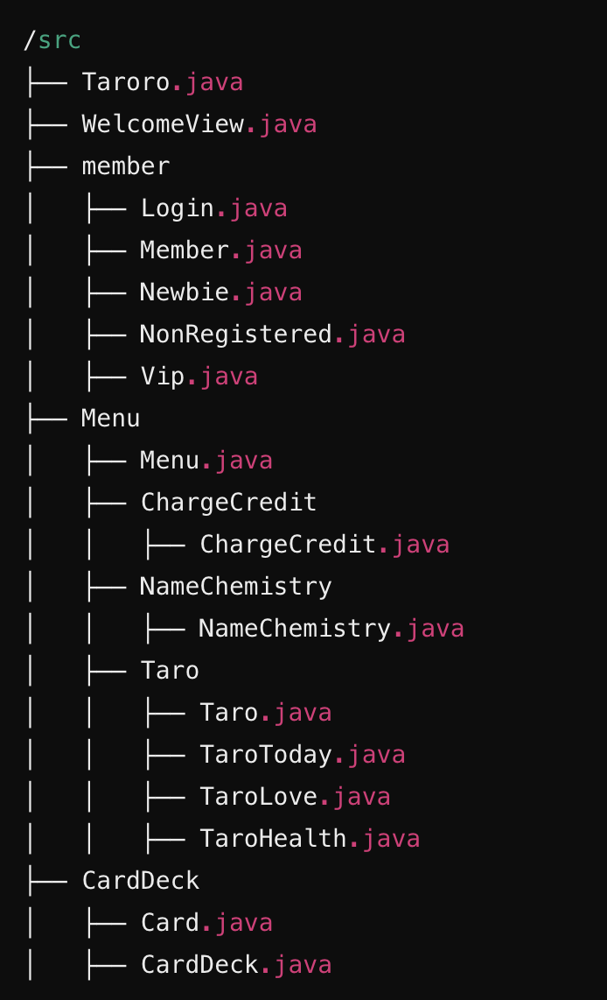
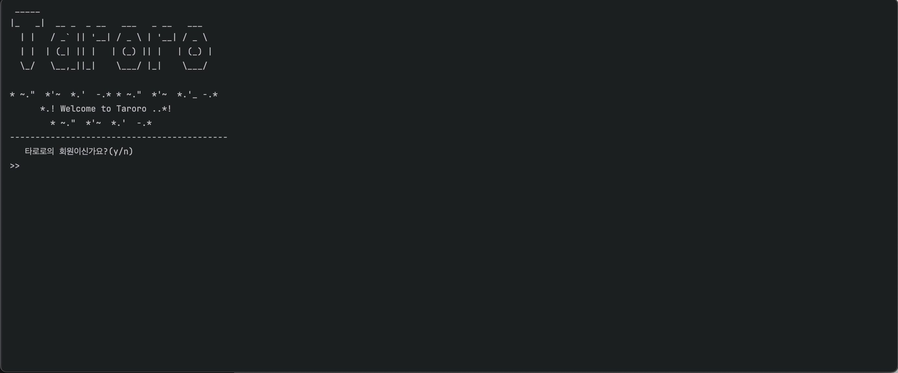
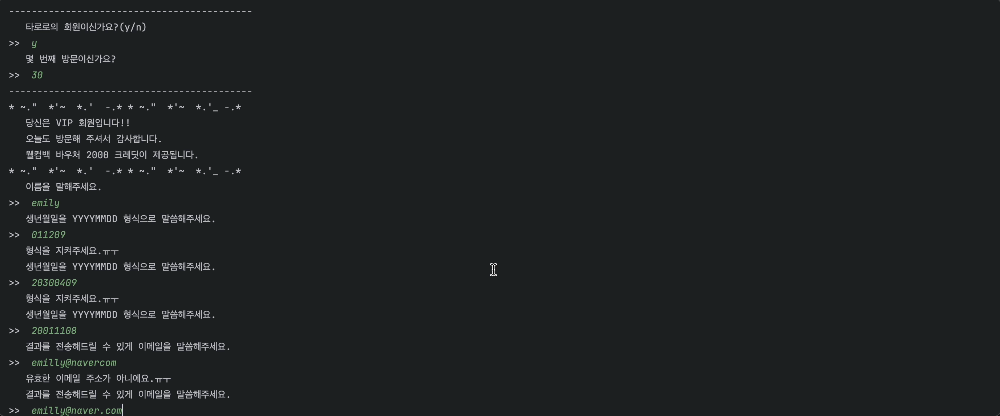
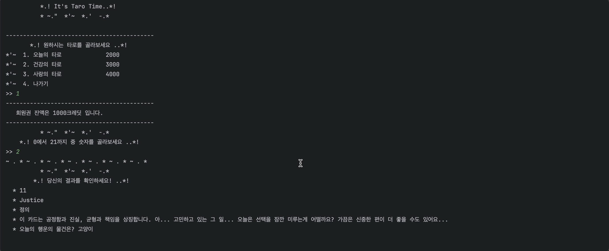
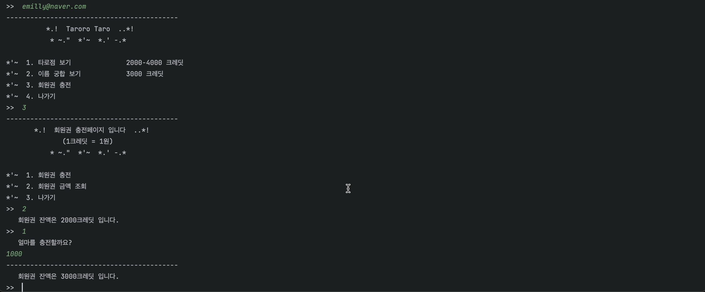
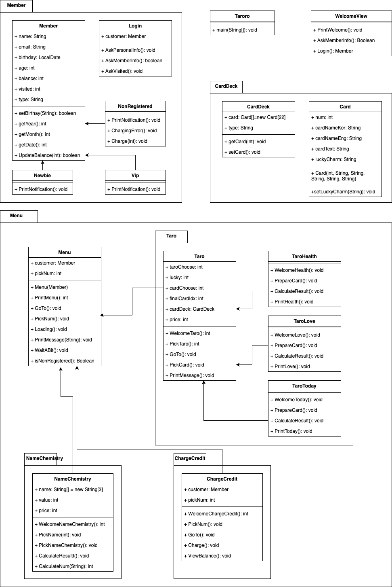

# 🔮 Taroro 타로 카페

## Welcome to Taroro!

---
타로로는 __JAVA__ 로 쓰여진 타로 카페 시뮬레이션 __콘솔기반(CLI)__ 프로그램입니다.   
타로로에서는 주제별 타로, 이름 궁합 등을 체험할 수 있습니다.  

## 유저 시나리오

---
1. 회원 정보 등록
2. 타로점 보기
   1. 오늘의 타로점 보기
   2. 건강의 타로점 보기
   3. 사랑의 타로점 보기
3. 이름 궁합 보기
4. 회원권 충전하기
   1. 회원권 충전하기
   2. 회원권 조회하기
5. 반복 혹은 나가기  

## 파일 구조도

---

## 메인 화면

---

## 주요 기능

---
### 회원 정보 등록

### 타로점 보기

### 이름 궁합 보기

### 회원권 충전

## 클래스 다이어그램

---

